# AWS Terraform + Ansible + Jenkins

## Опис

У цьому проекті автоматизовано створення AWS-інфраструктури для Jenkins CI/CD:
- VPC з публічною та приватною підмережами
- EC2 інстанси для Jenkins master та worker
- Security Groups з безпечними правилами доступу
- Internet Gateway, NAT Gateway
- S3 bucket для зберігання Terraform state
- Автоматичне встановлення Jenkins, nginx, Java, Docker, Node.js через Ansible
- Готовий pipeline для збірки, тестування та деплойменту Docker-образів

Вся інфраструктура та софт розгортаються повністю автоматично через Terraform та Ansible.

## Архітектура проекту

Проект реалізує повністю автоматизовану CI/CD інфраструктуру на AWS з використанням Terraform, Ansible та Jenkins. Основні компоненти:

- **AWS**: Хмарна платформа для розгортання інфраструктури.
- **Terraform**: Описує та створює всі ресурси AWS (VPC, Subnet, EC2, Security Group, S3).
- **Ansible**: Автоматизує встановлення Jenkins, nginx, Java, Docker, Node.js на EC2.
- **Jenkins**: CI/CD сервер, master та worker (agent) для виконання pipeline.
- **Docker**: Використовується для збірки та тестування додатків на worker-node.

### Взаємодія компонентів
- **Terraform** створює інфраструктуру: VPC, підмережі, EC2 (master/worker), Security Groups, S3 для стейту.
- **Ansible** конфігурує EC2 інстанси: встановлює Jenkins master, налаштовує worker (Java, Docker, Node.js, SSH).
- **Jenkins master** керує pipeline, підключається до worker через SSH (з використанням credentials, без копіювання приватного ключа).
- **Worker-node** виконує CI/CD job, збирає Docker-образи, запускає тести, пушить образи на Docker Hub.

Архітектура забезпечує безпечний доступ, ізоляцію середовищ, автоматизацію деплойменту та масштабування.

### Структура проекту

```text
📁 terraform/
└── enviroments/
    └── dev/
        ├── main.tf           # Головний файл, підключення модулів
        ├── variables.tf      # Змінні середовища
        ├── dev.tfvars        # Значення змінних для dev
        ├── locals.tf         # Локальні змінні
        ├── data.tf           # Data sources
        ├── terraform.tf      # Backend та провайдери
        ├── ansible_hosts.tpl # Шаблон інвентаря для Ansible
        ├── ansible_hosts     # Згенерований інвентар для Ansible
        └── .terraform.lock.hcl # Lock-файл залежностей
📁 modules/
├── vpc/                # Модуль VPC
│   ├── vpc.tf
│   ├── variables.tf
│   └── outputs.tf
├── public_subnet/      # Модуль публічної підмережі
│   ├── public_subnet.tf
│   ├── variables.tf
│   └── outputs.tf
├── private_subnet/     # Модуль приватної підмережі
│   ├── private_subnet.tf
│   ├── variables.tf
│   └── outputs.tf
├── internet_gateway/   # Модуль Internet Gateway
│   ├── internet_getway.tf
│   ├── variables.tf
│   └── outputs.tf
├── nat_gateway/        # Модуль NAT Gateway
│   ├── nat_getway.tf
│   ├── variables.tf
│   └── outputs.tf
├── network/            # Модуль Security Groups
│   ├── security_group.tf
│   ├── variables.tf
│   └── outputs.tf
└── ec2/                # Модуль EC2 інстансів
    ├── ec2.tf
    ├── variables.tf
    └── outputs.tf
```

## Схема мережі AWS

```text
                +-------------------+
                |    S3 Bucket      |
                +-------------------+
                         ^
                         |
                 Terraform State
                         |
+-------------------------------------------------------------+
|                         VPC (10.0.0.0/16)                   |
|                                                             |
|   +-------------------+           +-------------------+     |
|   |  Public Subnet    |           |  Private Subnet   |     |
|   |   (10.0.1.0/24)   |           |   (10.0.2.0/24)   |     |
|   |                   |           |                   |     |
|   | +---------------+ |           | +---------------+ |     |
|   | | EC2 Master    | |           | | EC2 Worker    | |     |
|   | | Jenkins/nginx | |           | | Docker/Node.js| |     |
|   | +---------------+ |           | +---------------+ |     |
|   +-------------------+           +-------------------+     |
|         |      ^                          ^                 |
|         |      |                          |                 |
|         v      |                          |                 |
|   +-------------------+                   |                 |
|   | Internet Gateway  |                   |                 |
|   +-------------------+                   |                 |
|         |                                 |                 |
|         v                                 |                 |
|   +-------------------+                   |                 |
|   |   NAT Gateway     |-------------------+                 |
|   +-------------------+                                     |
+-------------------------------------------------------------+
```

## 🧠 Що робить Terraform

Terraform — це інструмент для опису та автоматичного створення хмарної інфраструктури як коду (IaC). Він дозволяє:
- Створювати, змінювати та видаляти ресурси AWS (VPC, EC2, Security Groups, S3) через декларативні файли.
- Відстежувати всі зміни інфраструктури через state-файл.
- Масштабувати та повторно використовувати модулі для різних середовищ.
- Забезпечити контроль версій та командну роботу над інфраструктурою.

## Чому Terraform і Ansible?

**Terraform** — це інструмент для опису та автоматичного створення хмарної інфраструктури як коду (IaC). Він дозволяє:
- Створювати, змінювати та видаляти ресурси AWS (VPC, EC2, Security Groups, S3) через декларативні файли.
- Відстежувати всі зміни інфраструктури через state-файл.
- Масштабувати та повторно використовувати модулі для різних середовищ.
- Забезпечити контроль версій та командну роботу над інфраструктурою.

**Ansible** — це інструмент для автоматизації конфігурації серверів та розгортання софту. Він дозволяє:
- Встановлювати Jenkins, nginx, Java, Docker, Node.js на EC2 інстанси.
- Описувати всі дії у вигляді playbook (yaml-файли), що легко читати та підтримувати.
- Автоматизувати оновлення, деплой, налаштування без ручних втручань.
- Працювати без агентів — лише через SSH.

### Чому краще використовувати саме Terraform і Ansible?
- **Автоматизація**: Всі ресурси та налаштування створюються автоматично, без ручної роботи.
- **Відтворюваність**: Можна швидко розгортати ідентичну інфраструктуру для тесту, продакшн чи recovery.
- **Безпека**: Чітко контролюються всі доступи, ключі, правила firewall.
- **Масштабованість**: Легко додавати нові ресурси, змінювати конфігурацію, масштабувати під навантаження.
- **Зручність**: Весь процес описаний у коді, легко підтримувати, оновлювати, передавати команді.

Terraform і Ansible — це сучасний стандарт для DevOps, який дозволяє швидко, безпечно та ефективно керувати інфраструктурою та софтом.
## 📋 Передумови

Перед початком переконайтеся, що у вас є:

- ✅ AWS аккаунт (безкоштовний tier підійде)
- ⏳ AWS CLI (встановимо в кроці 1)
- ⏳ Terraform (встановимо в кроці 2)
- ✅ Базове розуміння командного рядка
- ✅ Текстовий редактор (VS Code рекомендується)

## 🔐 Крок 1: Налаштування AWS доступу

**Мета**: Встановити AWS CLI і налаштувати безпечний доступ до AWS для Terraform

### 1.1 Встановлення AWS CLI

**Статус**: ✅ Завершено (aws-cli/2.31.32)

AWS CLI потрібен для взаємодії з AWS з командного рядка. Terraform використовує ті ж самі credentials.

**📋 Детальні інструкції**: [install-aws-cli.md](docs/install-aws-cli.md)  

**Швидке встановлення для Windows:**
1. Завантажте MSI installer: https://awscli.amazonaws.com/AWSCLIV2.msi
2. Запустіть installer → Перезапустіть термінал
3. Перевірте: `aws --version` (має показати aws-cli/2.31.32)

### 1.2 Проблема з правами доступу до S3

**❌ Проблема**: Початковий користувач AWS не мав прав для створення S3 bucket та роботи з Terraform backend.

**🔍 Причина**: У основного AWS користувача були обмежувальні політики (explicit deny), які блокували доступ до S3 сервісу.

**✅ Рішення**: Створити окремого користувача спеціально для Terraform з мінімальними необхідними правами.


## 🛠️ Крок 2: Встановлення Terraform

**Статус**: ✅ Завершено (Terraform v1.13.5)

**Мета**: Встановити Terraform для керування інфраструктурою як код (IaC)

**📋 Детальні інструкції**: [install-terraform.md](docs/install-terraform.md)

**Швидке встановлення:**
1. Завантажити з https://www.terraform.io/downloads.html
2. Розпакувати і додати до PATH
3. Або через winget: `winget install Hashicorp.Terraform`
4. Перевірити: `terraform --version` (має показати v1.13.5)

## Налаштування AWS користувача
1. Створіть IAM користувача з ім'ям `sk-terraform-user`. **📋 Детальні інструкції**: [create-terraform-user.md](docs/create-terraform-user.md)
2. Згенеруйте для нього Access Key та Secret Key (**📋 Налаштування credentials**: [aws-credentials-setup.md](docs/aws-credentials-setup.md)).
3. Додайте користувачу такі права:
   - `AmazonEC2FullAccess`
   - Кастомна політика `S3AccessOnlyToSvitlanaKizilpinarBucket` ([детальніше про EC2 політики](docs/add-ec2-permissions.md)).
4. Не створюйте новий S3 bucket! Використовуйте вже наданий bucket: `terraform-state-danit10-devops` (region: eu-central-1).

> **Примітка:** Для цього проекту створювати новий S3 bucket не потрібно — використовується вже існуючий bucket від школи: `terraform-state-danit10-devops` (region: eu-central-1).

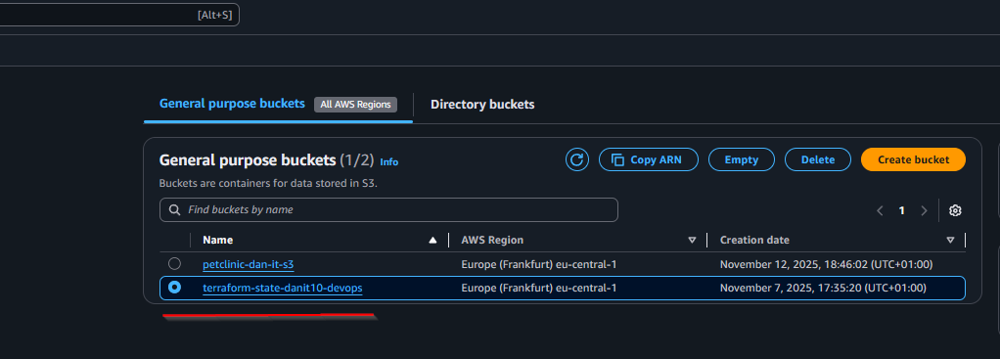

## 🗄️ Крок 3: Створення S3 Bucket для Terraform state

**Мета:** Надійно зберігати Terraform state-файл у хмарі для командної роботи, резервування та безпеки.

- Використовується S3 bucket з versioning, шифруванням та блокуванням публічного доступу.
- Для production — рекомендується додатково використовувати DynamoDB для блокування state.

**Детальна покрокова інструкція:** [docs/s3-backend-guide.md](docs/s3-backend-guide.md)

**Коротко:**
1. Відкрийте AWS S3 Console → Create bucket
2. Вкажіть унікальне ім'я (наприклад, `terraform-state-svitlana-vpc`), регіон `eu-central-1`
3. Увімкніть Block all public access, Versioning, Encryption (AES-256)
4. Збережіть bucket — використовуйте його для backend у Terraform

## ⚡ Крок 4: Ініціалізація та запуск Terraform

**Мета:** Створити всю AWS-інфраструктуру автоматично.

1. Перейдіть у папку з вашим середовищем:
   ```bash
   cd terraform/enviroments/dev
   ```
2. Запустіть ініціалізацію, план або застосування інфраструктури через скрипт:
   ```bash
   bash ../../terraform-init.sh dev init
   bash ../../terraform-init.sh dev plan
   bash ../../terraform-init.sh dev apply
   ```
   > Скрипт автоматизує всі необхідні кроки для роботи з Terraform у цьому проекті.

3. Перевірте створені ресурси в AWS Console (EC2, VPC, S3, Security Groups).
4. Перегляньте outputs Terraform — там будуть IP-адреси, імена ресурсів тощо.

**Порада:**
- Для повторного запуску/зміни інфраструктури використовуйте ті ж команди.
- Всі зміни відстежуються у S3 bucket через Terraform state.


## 📊 Результати створення ресурсів Terraform

| №  | Ресурс/Етап            | Опис/Тип                            | Скриншот                                                                      |
|----|------------------------|-------------------------------------|-------------------------------------------------------------------------------|
| 1  | VPC                    | Основна мережа                      |                                                    |
| 2  | Public Subnet          | Публічна підмережа                  | 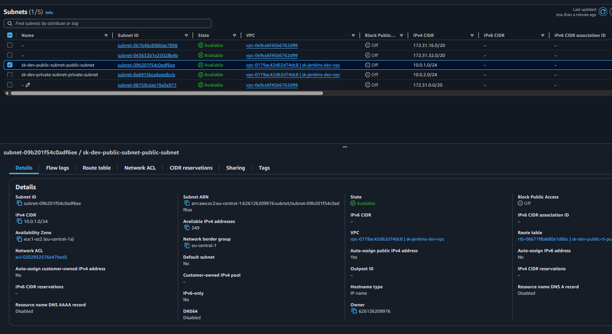                               |
| 3  | Private Subnet         | Приватна підмережа                  | 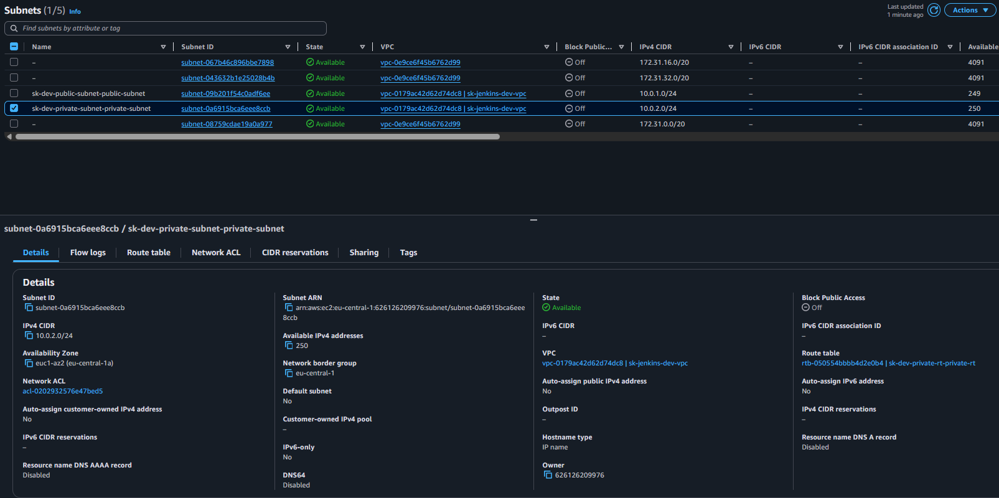                             |
| 4  | Public Route Table     | Таблиця маршрутів                   | 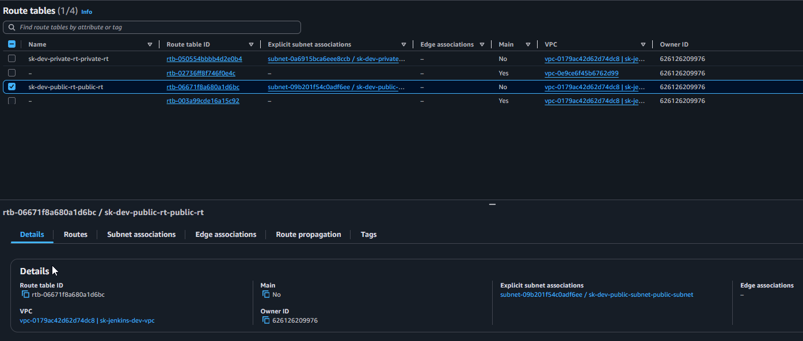                             |
| 5  | Pub. Route Table Assoc.| Асоціація маршрутів                 | 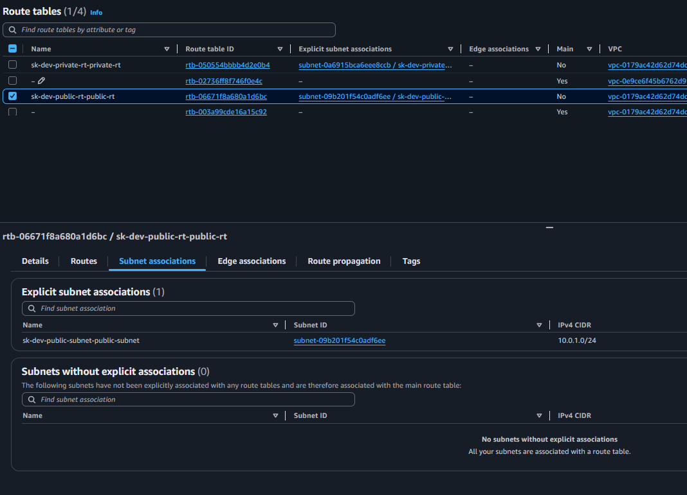  |
| 6  | Privat Route Table     | Таблиця маршрутів                   | 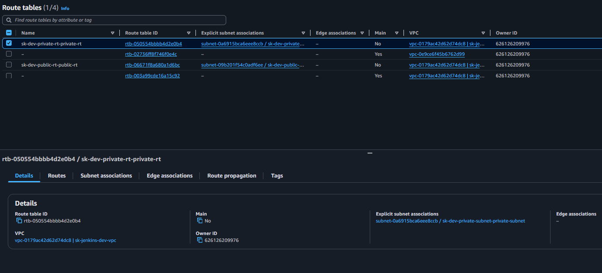                            |
| 7  | Pri. Route Table Assoc.| Асоціація маршрутів                 | 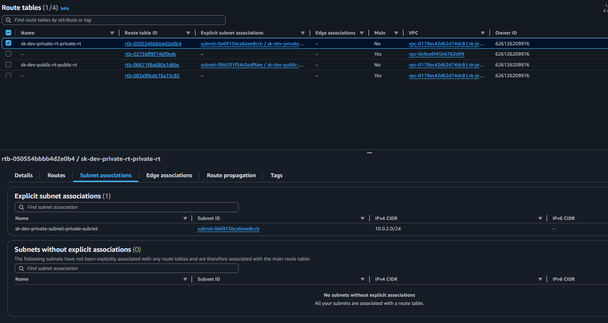 |
| 8  | Internet Gateway       | Доступ до інтернету                 | 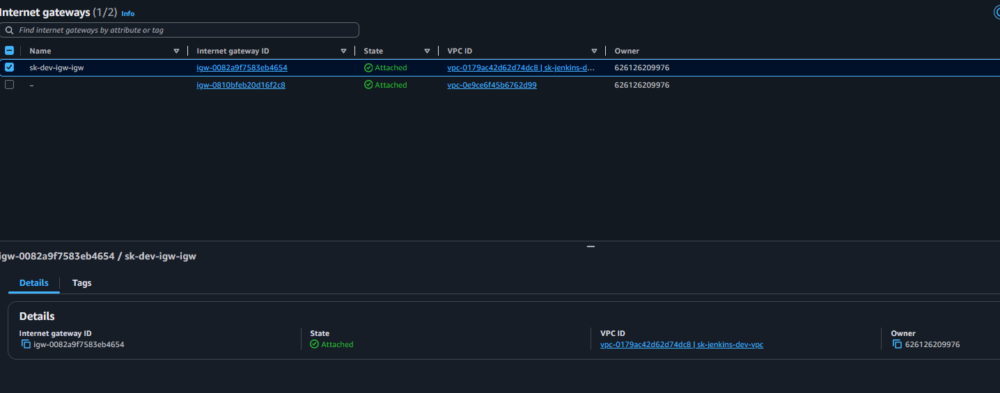                                      |
| 9  | NAT Gateway            | Вихід у інтернет з приватної мережі | 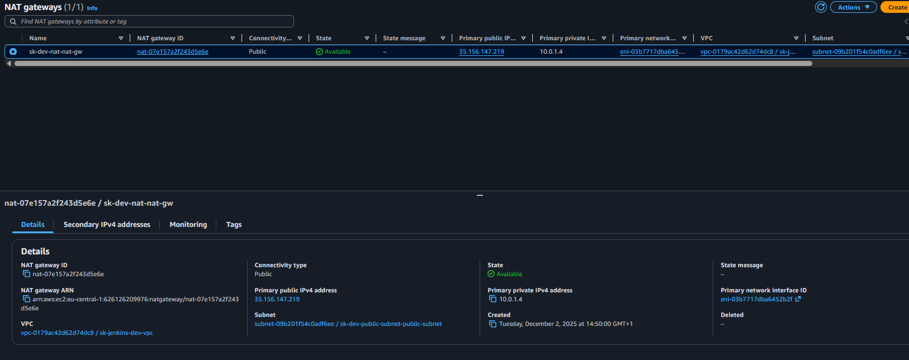                                         |
| 10 | Pub.Security Groups    | Firewall правила                    | 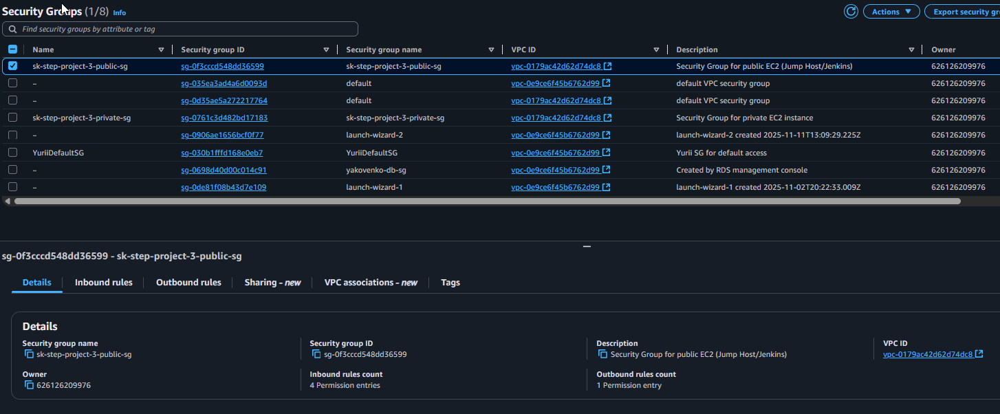                                 |
| 11 | Pub.SG Outbound rule   | Firewall правила                    | 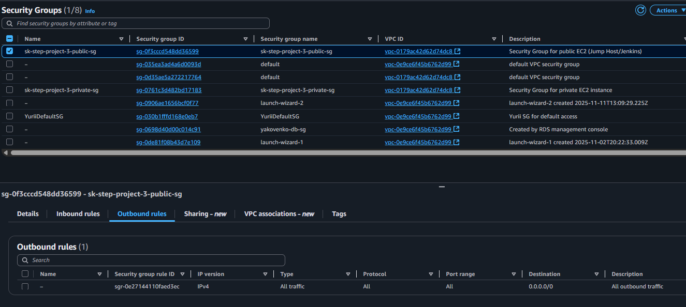                 |
| 12 | Pub.SG Inbound rule    | Firewall правила                    |                   |
| 13 | Pri.Security Groups    | Firewall правила                    | 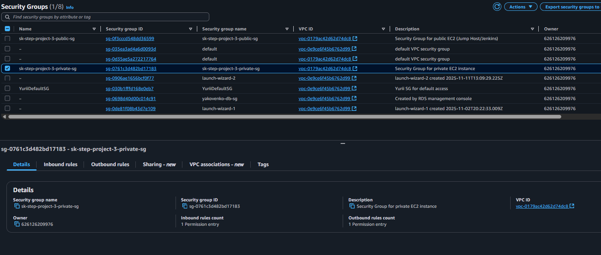                                |
| 14 | Pri.SG Outbound rule   | Firewall правила                    |                 |
| 15 | Pri.SG Inbound rule    | Firewall правила                    | 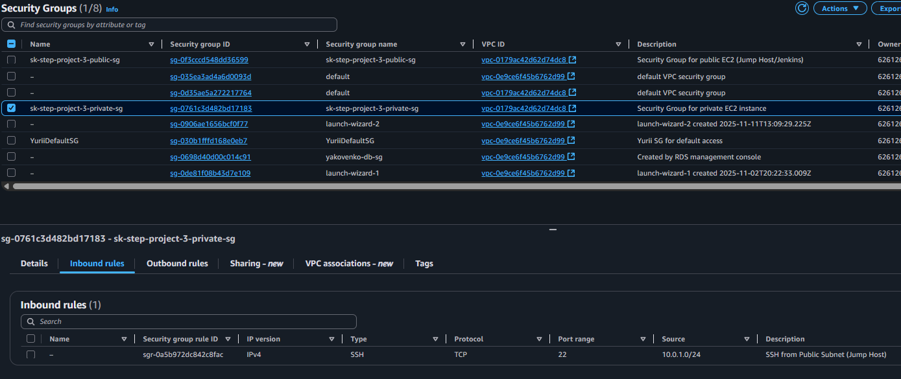                 |
| 16 | EC2 Master             | Jenkins/nginx                       | 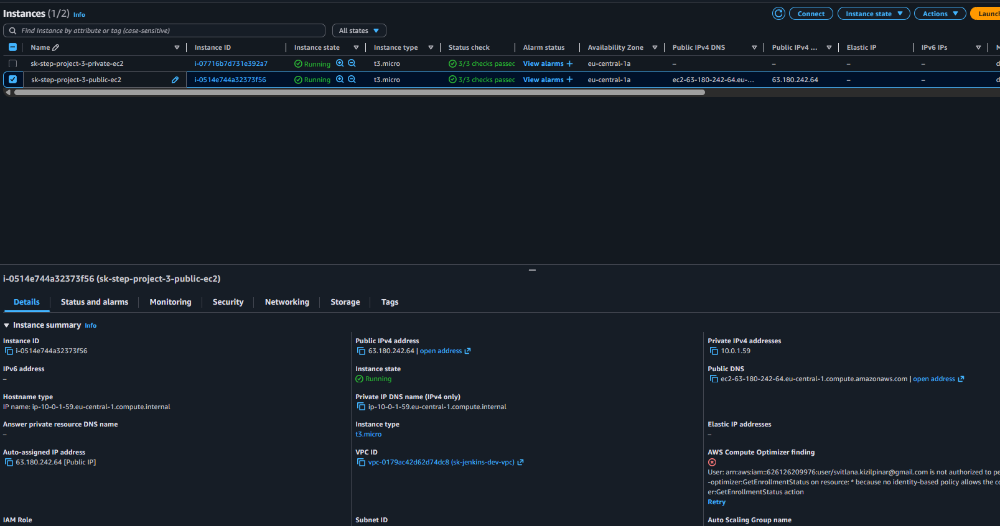                                     |
| 17 | EC2 Master lifecycle   | Jenkins/nginx                       | 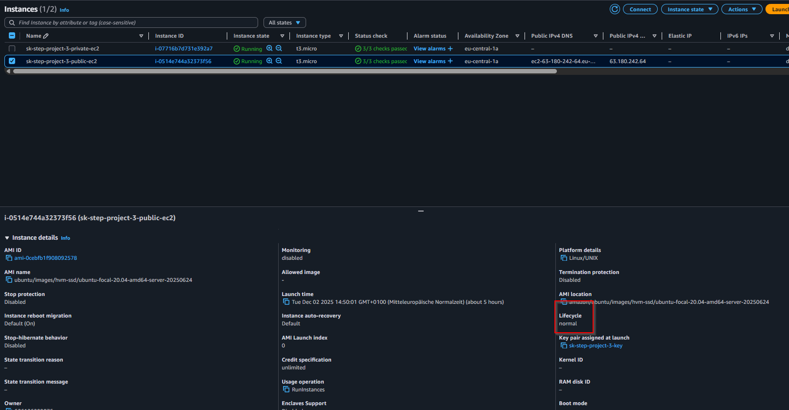                         |
| 18 | EC2 Master security    | Jenkins/nginx                       | 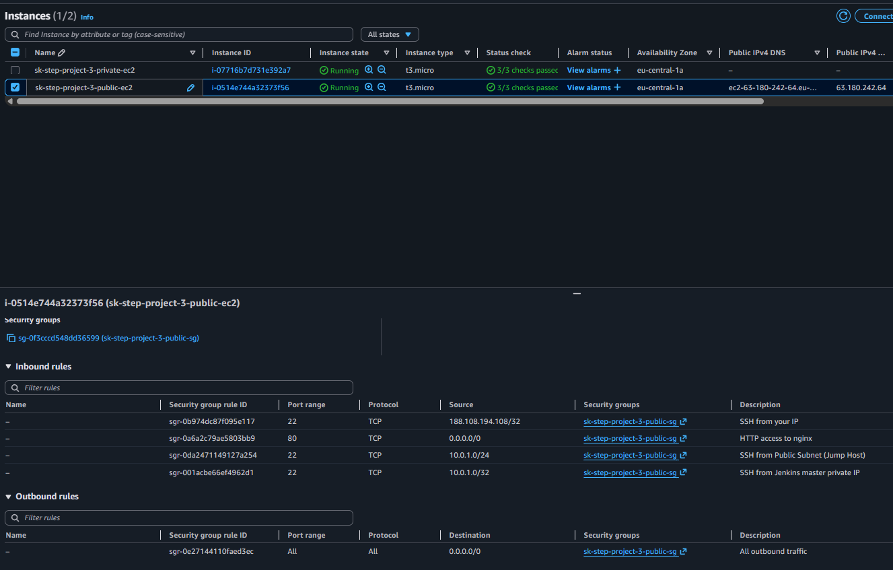                          |
| 19 | EC2 Worker             | Docker/Node.js                      |                                      |
| 20 | EC2 Worker lifecycle   | Docker/Node.js                      | 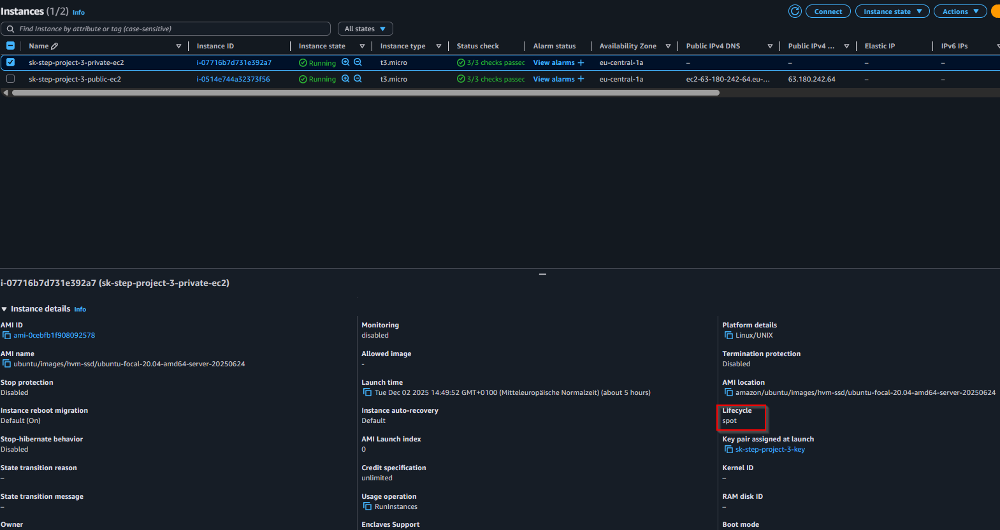                        |
| 21 | EC2 Worker security    | Docker/Node.js                      | 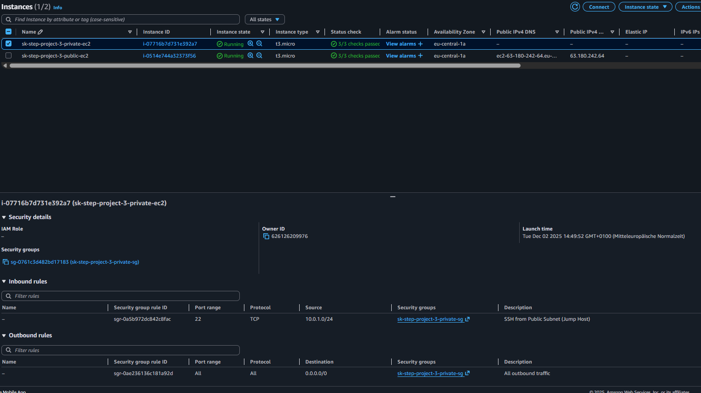                         |

---

> **Всі ресурси створюються автоматично через Terraform. Скриншоти підтверджують успішне створення кожного елементу інфраструктури.**

## 🚀 Крок 5: Налаштування Ansible та серверів

**Мета:** Автоматизувати налаштування та розгортання софту на EC2 інстансах

### 1️⃣ Копіювання SSH-ключів у Ubuntu (WSL)
У Windows ключі:
```
C:\Users\Svitlana\.ssh\id_rsa
C:\Users\Svitlana\.ssh\id_rsa.pub
```
У WSL (Ubuntu) виконайте:
```bash
mkdir -p ~/.ssh
cp /mnt/c/Users/Svitlana/.ssh/id_rsa ~/.ssh/id_rsa
cp /mnt/c/Users/Svitlana/.ssh/id_rsa.pub ~/.ssh/id_rsa.pub
chmod 600 ~/.ssh/id_rsa
```


### 2️⃣ Перевірка SSH підключення
```bash
ssh -i ~/.ssh/id_rsa ubuntu@<PUBLIC_IP>

Або для підключення до приватного worker через jump host:
```bash
ssh -i ~/.ssh/id_rsa -o ProxyCommand="ssh -i ~/.ssh/id_rsa -W %h:%p ubuntu@<PUBLIC_IP>" ubuntu@<PRIVATE_IP>
```
Де `<PUBLIC_IP>` — IP master (jump host), `<PRIVATE_IP>` — IP worker.
```

### 3️⃣ Ansible inventory шаблон
У `terraform/environments/dev/ansible_hosts.tpl`:
```ini
[jump]
${public_ip}

[worker]
${private_ip}

[jump:vars]
ansible_user=ubuntu
ansible_ssh_private_key_file=~/.ssh/id_rsa

[worker:vars]
ansible_user=ubuntu
ansible_ssh_private_key_file=~/.ssh/id_rsa
ansible_ssh_common_args='-o ProxyCommand="ssh -i ~/.ssh/id_rsa -W %h:%p ubuntu@${public_ip}"'
```

### 4️⃣ Запуск Ansible playbook
```bash
ansible-playbook -i terraform/environments/dev/ansible_hosts playbook.yml
```
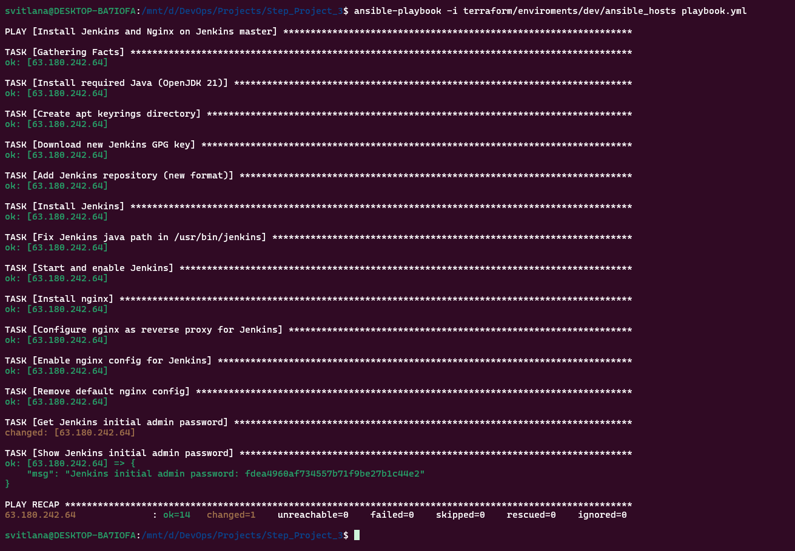

### 5️⃣ Запуск playbook для worker
Після основного playbook запустіть додатковий для worker:
```bash
ansible-playbook -i terraform/environments/dev/ansible_hosts worker_playbook.yml
```
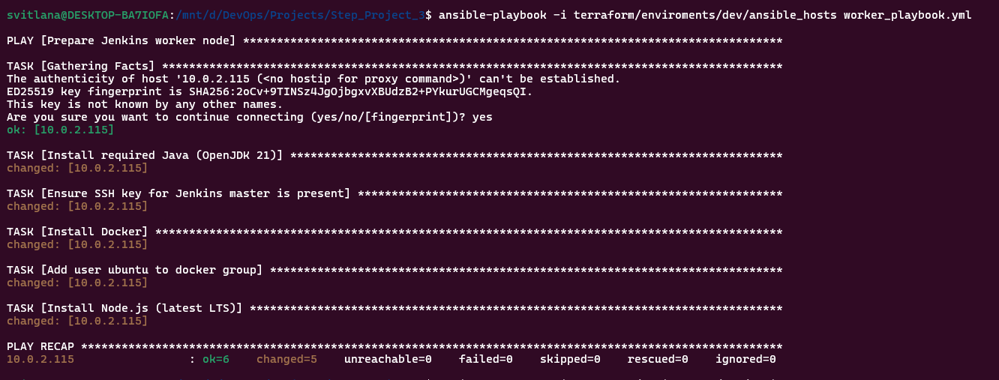

> **Цей playbook встановлює Docker, Node.js та додаткові компоненти на worker-node для роботи pipeline.

> **Важливо!** Після запуску playbook у кінці буде виведено initial admin password для Jenkins. Збережіть цей пароль — він потрібен для першого входу в Jenkins.

---

## ⚙️ Крок 6: Налаштування Jenkins та pipeline

Детальна інструкція по налаштуванню Jenkins та pipeline — у документації:

👉 [docs/jenkins-setup.md](docs/jenkins-setup.md)

## 🎉 Крок 6: Завершення

Успішно налаштувано автоматизовано CI/CD інфраструктуру на AWS з використанням Terraform, Ansible та Jenkins.

Тепер можемо:
- Швидко розгортати нові середовища для тестування, продакшн тощо.
- Легко масштабувати інфраструктуру під навантаження.
- Автоматизувати деплоймент та моніторинг ваших додатків.

