# Документація по налаштуванню Jenkins

## Опис

У цьому документі описано покрокове налаштування Jenkins після автоматичного розгортання на AWS через Terraform та Ansible. 

## 1️⃣ Доступ до Jenkins

- Веб-інтерфейс Jenkins доступний лише через nginx reverse proxy:
  - URL: `http://<EC2-Master-Public-IP>/`
- Прямий доступ до порту Jenkins (8080) закритий Security Group.

## 2️⃣ Перший вхід

- Після запуску Ansible playbook у кінці буде виведено initial admin password для Jenkins.
- Скопіюйте цей пароль та використайте для першого входу.
- Натисніть **"Continue"**

## 3️⃣ Налаштування Jenkins

### 3.1 Встановлення плагінів

Оберіть **"Install suggested plugins"**

### 3.2 Створення адміністратора

Заповніть форму створення користувача:
- **Username**: ваш username
- **Password**: надійний пароль
- **Full name**: ваше ім'я
- **Email**: ваш email

### 3.3 Налаштування URL

Залиште URL за замовчуванням: `http://<public_ip_public_ec2>`

Тепер Jenkins готовий до роботи!

### 3.4 Підключення Worker Node

#### 3.4.1 Відкриття Manage Nodes

1. Перейдіть до **"Manage Jenkins"**
2. Оберіть **"Nodes"**

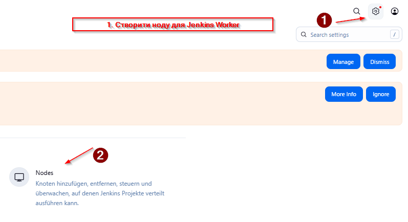

#### 3.4.2 Створення нового Node

1. Натисніть **"New Node"**
2. Введіть назву: `worker-node`
3. Оберіть **"Permanent Agent"**

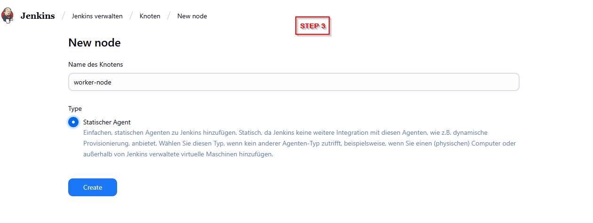

#### 3.4.3 Налаштування Worker Node

Заповніть параметри:
- **Name**: `worker-node`
- **Description**: `Docker worker for builds`
- **Number of executors**: `2`
- **Remote root directory**: `/home/ubuntu`
- **Labels**: `worker docker nodejs`
- **Usage**: `Use this node as much as possible`
- **Launch method**: `Launch agents via SSH`

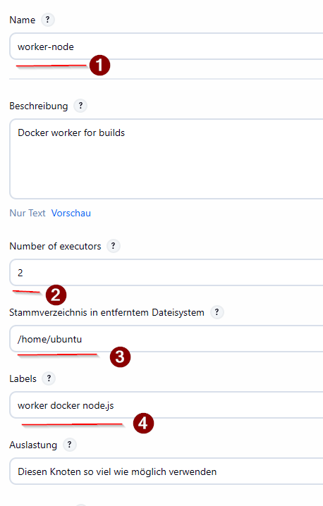

#### 3.4.4 SSH налаштування

- **Host**: `<private_ip_private_ec2>`
- **Credentials**: створіть нові (див. наступний крок)
- **Host Key Verification Strategy**: `Non verifying Verification Strategy`

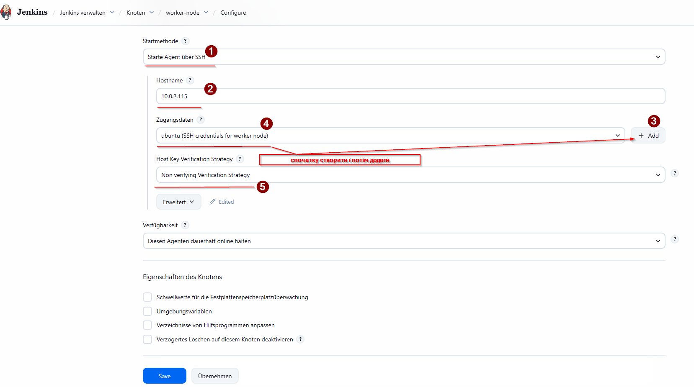

#### 3.4.5 Створення SSH Credentials

1. Натисніть **"Add" → "Jenkins"**
2. **Kind**: `SSH Username with private key`
3. **Username**: `ubuntu`
4. **Private Key**: оберіть "Enter directly" та вставте вміст вашого приватного ключа `~/.ssh/id_rsa` (з WSL)
5. **ID**: `worker-ssh-credentials`
6. **Description**: `SSH credentials for worker node`

Після створення credentials — збережіть налаштування та перевірте логи Jenkins (Manage Jenkins → System Log), щоб переконатися, що worker-node успішно підключився через SSH.

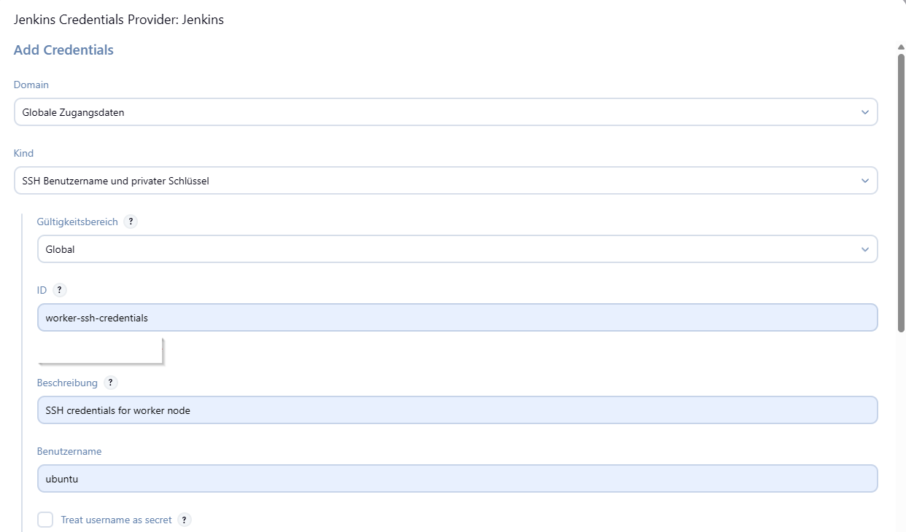
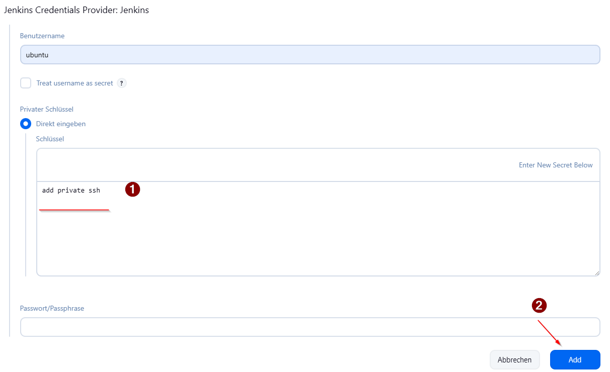
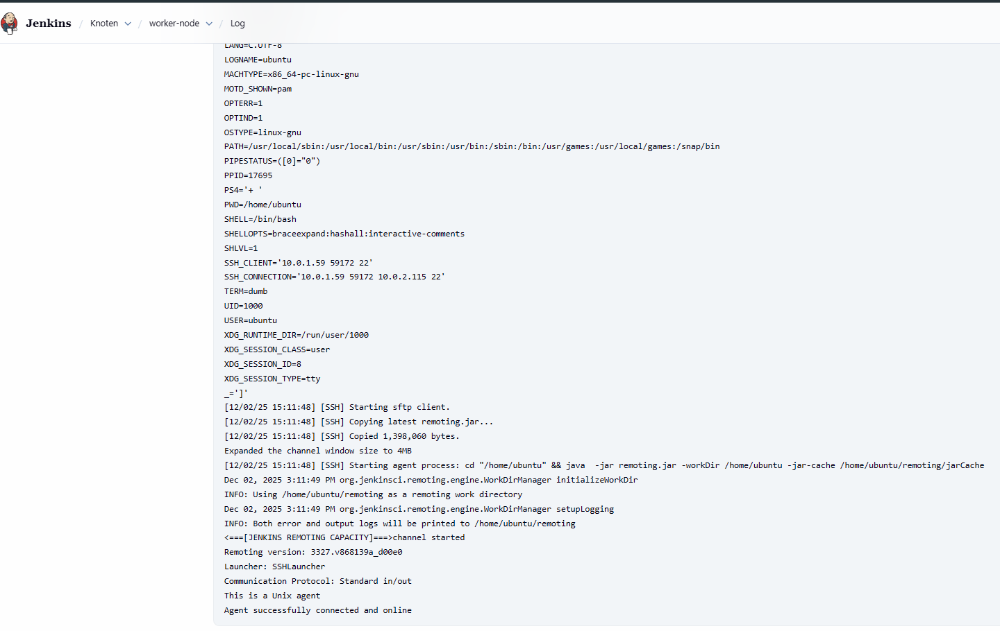

## 🐳 4: Налаштування Docker Hub

### 4.1 Створення Access Token

1. Увійдіть на https://hub.docker.com
2. **Account Settings** → **Security** → **New Access Token**
3. **Description**: `Jenkins CI/CD`
4. **Access permissions**: `Read, Write, Delete`
5. **Generate** і збережіть токен

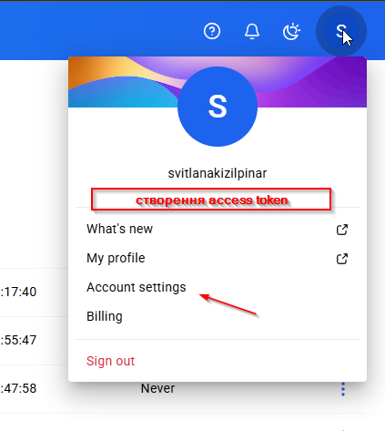
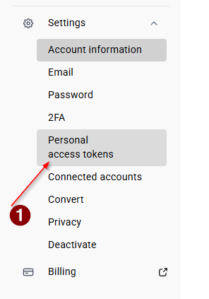
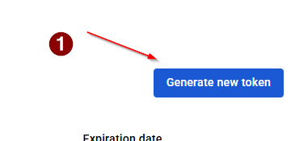
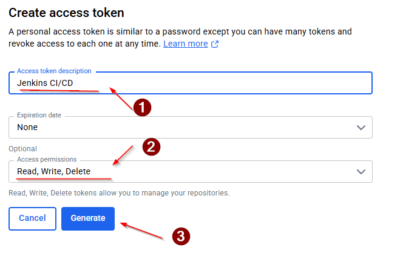

### 4.2 Додавання Docker Hub Credentials

1. **Manage Jenkins** → **Manage Credentials**
2. **Add Credentials**
3. **Kind**: `Username with password`
4. **Username**: ваш Docker Hub username
5. **Password**: згенерований токен
6. **ID**: `dockerhub-credentials`

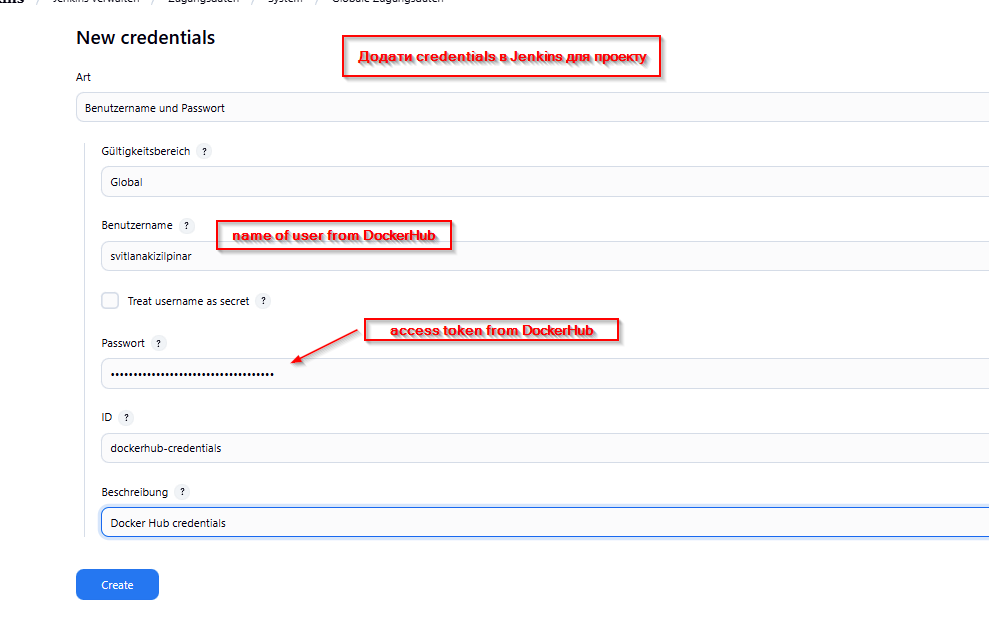

## 📝 5: Створення Pipeline

### 5.1 Створення нового Job

1. Головна сторінка → **"New Item"**
2. **Name**: `nodejs-docker-pipeline`
3. **Type**: `Pipeline`

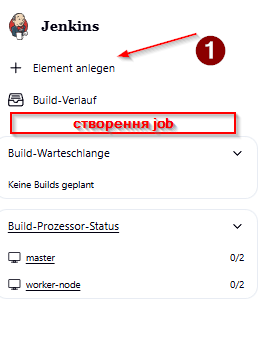
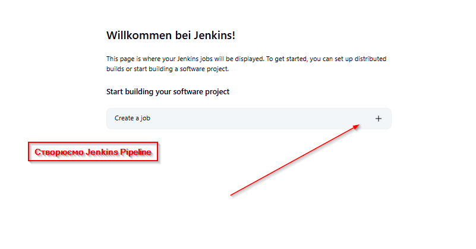
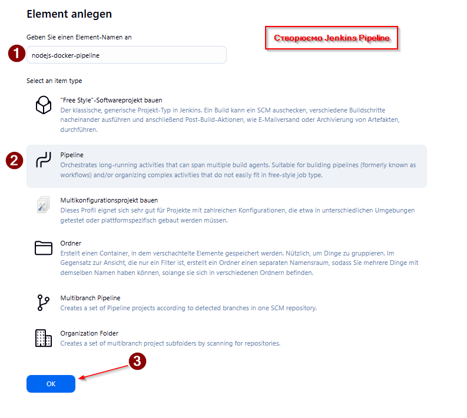

### 5.2 Налаштування Pipeline

У розділі **Pipeline** → **Script** вставте:

```groovy
pipeline {
    agent {
        label 'worker'
    }
    
    environment {
        DOCKER_HUB_REPO = 'your-username/jenkins-node-js'
        DOCKER_HUB_CREDENTIALS = 'dockerhub-credentials'
    }
    
    stages {
        stage('Checkout') {
            steps {
                git branch: 'main', url: 'https://github.com/SvitLanaSvit/DevOps_Project_2_Jenkins.git'
            }
        }
        
        stage('Build Docker Image') {
            steps {
                script {
                    def imageTag = "${env.BUILD_NUMBER}"
                    sh "docker build -t ${DOCKER_HUB_REPO}:${imageTag} ."
                    sh "docker tag ${DOCKER_HUB_REPO}:${imageTag} ${DOCKER_HUB_REPO}:latest"
                }
            }
        }
        
        stage('Run Tests') {
            steps {
                script {
                    def imageTag = "${env.BUILD_NUMBER}"
                    def testResult = sh(
                        script: "docker run --rm ${DOCKER_HUB_REPO}:${imageTag} test",
                        returnStatus: true
                    )
                    if (testResult != 0) {
                        currentBuild.result = 'FAILURE'
                        error("Tests failed")
                    }
                }
            }
        }
        
        stage('Push to Docker Hub') {
            when {
                expression { currentBuild.result == null || currentBuild.result == 'SUCCESS' }
            }
            steps {
                script {
                    def imageTag = "${env.BUILD_NUMBER}"
                    withCredentials([usernamePassword(credentialsId: "${DOCKER_HUB_CREDENTIALS}", 
                                                    usernameVariable: 'DOCKER_USERNAME', 
                                                    passwordVariable: 'DOCKER_PASSWORD')]) {
                        sh "echo \$DOCKER_PASSWORD | docker login -u \$DOCKER_USERNAME --password-stdin"
                        sh "docker push ${DOCKER_HUB_REPO}:${imageTag}"
                        sh "docker push ${DOCKER_HUB_REPO}:latest"
                        echo "Successfully pushed image to Docker Hub!"
                    }
                }
            }
        }
    }
    
    post {
        failure {
            echo "Tests failed"
        }
        success {
            echo "Pipeline completed successfully!"
        }
        always {
            sh "docker system prune -f"
        }
    }
}
```

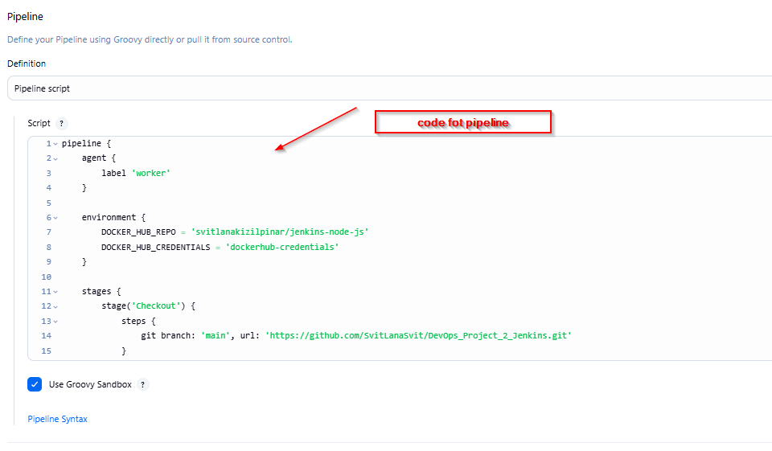

**Не забудьте змінити `your-username` на ваш Docker Hub username!**

## 🧪 Крок 6: Тестування Pipeline

### 6.1 Запуск Pipeline

Натисніть **"Build Now"**


### 6.2 Моніторинг виконання

Pipeline складається з 4 етапів:

1. **Checkout** - завантаження коду з GitHub
2. **Build Docker Image** - збірка Docker образу
3. **Run Tests** - запуск автоматичних тестів
4. **Push to Docker Hub** - публікація образу

### 6.3 Перегляд логів

Натисніть на будь-який етап для перегляду детальних логів:

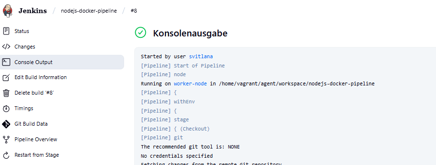

### 6.4 Успішний результат

При успішному виконанні ви побачите:

```
Started by user svitlana
[Pipeline] Start of Pipeline
[Pipeline] node
Running on worker-node in /home/vagrant/agent/workspace/nodejs-docker-pipeline
[Pipeline] {
[Pipeline] stage
[Pipeline] { (Checkout)
[Pipeline] git
Checking out Revision 12952bfea01cc70a8e3dc707806a32dfecfff35f
Commit message: "change in json"
[Pipeline] }
[Pipeline] stage
[Pipeline] { (Build Docker Image)
[Pipeline] sh
+ docker build -t svitlanakizilpinar/jenkins-node-js:8 .
#11 naming to docker.io/svitlanakizilpinar/jenkins-node-js:8 done
[Pipeline] sh
+ docker tag svitlanakizilpinar/jenkins-node-js:8 svitlanakizilpinar/jenkins-node-js:latest
[Pipeline] }
[Pipeline] stage
[Pipeline] { (Run Tests)
[Pipeline] sh
+ docker run --rm svitlanakizilpinar/jenkins-node-js:8 test

> app@1.0.0 test /app
> jest

PASS tests/app.test.js
  GET /
    ✓ responds to / (240 ms)

Test Suites: 1 passed, 1 total
Tests:       1 passed, 1 total
[Pipeline] }
[Pipeline] stage
[Pipeline] { (Push to Docker Hub)
[Pipeline] sh
+ echo ****
+ docker login -u svitlanakizilpinar --password-stdin
Login Succeeded
[Pipeline] sh
+ docker push svitlanakizilpinar/jenkins-node-js:8
8: digest: sha256:586494c1d577f4bad511719eef823d3e6e157b1d9c39d8ccfbb03ab8310012da size: 3049
[Pipeline] sh
+ docker push svitlanakizilpinar/jenkins-node-js:latest
latest: digest: sha256:586494c1d577f4bad511719eef823d3e6e157b1d9c39d8ccfbb03ab8310012da size: 3049
[Pipeline] echo
Successfully pushed image to Docker Hub!
[Pipeline] }
[Pipeline] echo
Pipeline completed successfully!
[Pipeline] End of Pipeline
Finished: SUCCESS
```

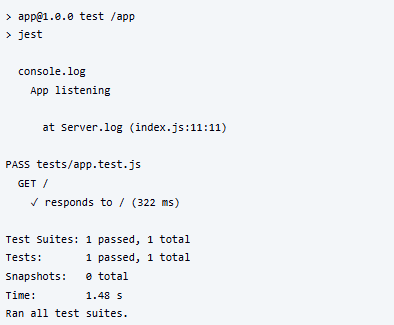
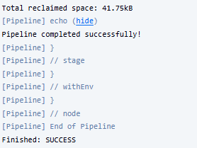
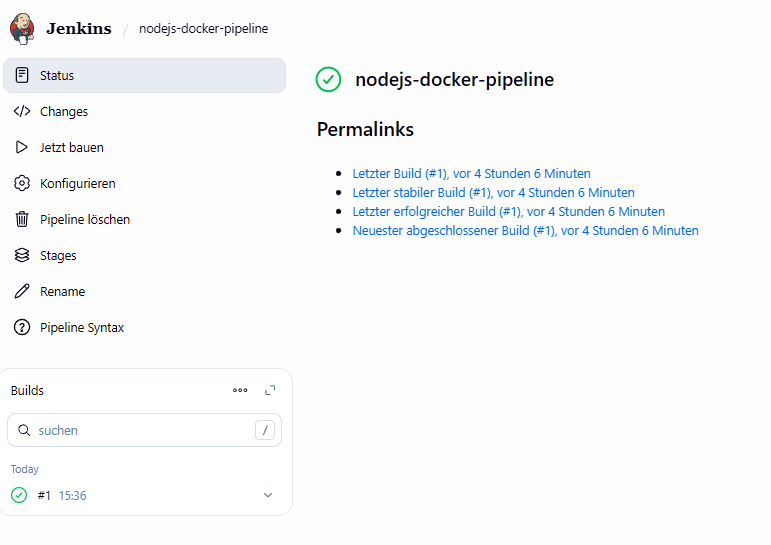
